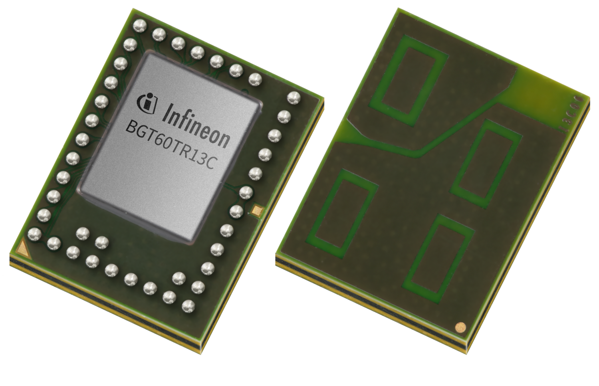
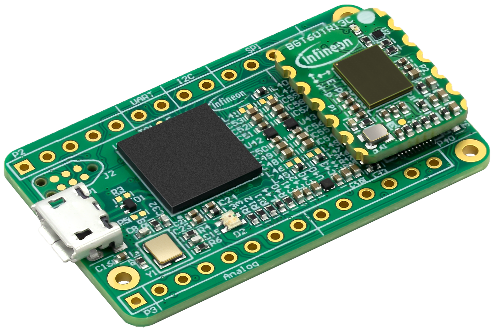
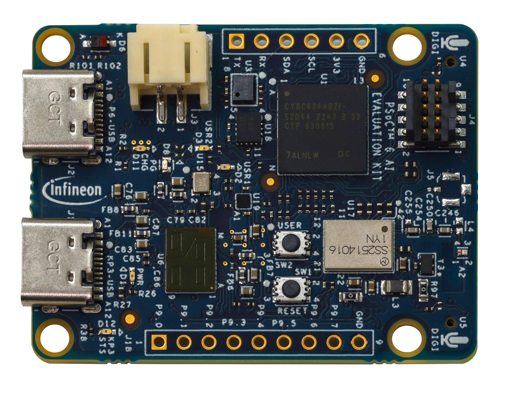
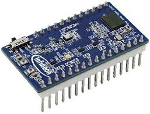

# XENSIV™ BGT60TR13C 60 GHz Radar Sensor

With this library Infineon's XENSIV™ BGT60TR13C 60 GHz radar sensor can be configured
and used with [Arduino](https://www.arduino.cc/) via SPI.

Please refer to the product pages linked below for more information about the sensor and supported evaluation boards.

> [!NOTE]  
> This project is work in progress and not covering all functions
of the sensor yet.   
> If you are missing any functionality feel free to [contribute](https://github.com/Infineon/arduino-xensiv-radar-sensor-bgt60tr13/fork) or [open an issue](https://github.com/Infineon/arduino-xensiv-radar-sensor-bgt60tr13/issues).

### Supported Products

<table>
    <tr>
        <td></td>
        <td></td>
        <td></td>
        <td></td>
    </tr>
    <tr>
        <td style="test-align : center"><a href="https://www.infineon.com/part/BGT60TR13C">XENSIV™ BGT60TR13C</a></td>
        <td style="test-align : center"><a href="https://www.infineon.com/evaluation-board/DEMO-BGT60TR13C">Demo kit with XENSIV™ BGT60TR13C 60 GHz radar sensor</a></td>
        <td style="test-align : center"><a href="https://www.infineon.com/evaluation-board/CY8CKIT-062S2-AI">PSOC™ 6 Artificial Intelligence Evaluation Kit</a></td>
        <td style="test-align : center"><a href="https://www.infineon.com/evaluation-board/KIT-CSK-BGT60TR13C">XENSIV™ connected sensor kit with XENSIV™ BGT60TR13C 60 GHz radar sensor</a></td>
    </tr>
</table>

## Getting Started

### Dependencies
This module depends on the [arduinoFFT module](https://github.com/kosme/arduinoFFT),
written by [kosme](https://github.com/kosme).

## Installation

### Arduino IDE Library Manager
Use the Arduino Library Manager and search for "BGT60TR13C" to find and install this library.

### Arduino IDE Manual Installation
Download the desired .zip library version from the repository [releases](https://github.com/Infineon/arduino-xensiv-radar-sensor-bgt60tr13/releases) section or directly from the main branch.

## Usage

### Things to consider when using this Library 
- The `readFifo` function can only transmit 8192 words,
which consist of 24 data bits
    - Maximum transmission possible: 24.576 bytes
- The chip returns an error when reading while the stack is full or empty
- Data can be checked for overflow or underflow errors using the `checkData` function
- Currently, only one of three receiver antennas are implemented.
  
> [!WARNING]  
> This code was written for the CY8CKIT-062S2-AI Board, which uses
> the SPIClassPSOC Class to define an SPI-Interface other than the
> default SPI-Instance. If another Board is used and needs a different
> SPI-interface than the default one, this needs to be implemented!
>
> Default when using another Board then the CY8CKIT-062S2-AI: Default SPI-Instance


### Example Code
```c++
// import Modul
#include "bgt60trxx_lib.hpp"

/// configuration values for chip
const size_t no_of_chirps = 1;
const size_t samples_per_chirp = 128;
const size_t words = samples_per_chirp * no_of_chirps;
const size_t ADC_DIV = 60;
const size_t start_freq = 62500000;  // in kHz
const size_t bandwidth  =  2000000;    // in kHz

/*
  Define the pins for the BGT60TR13C sensor.
  The Board used is the Infineon CY8CKIT-062S2-AI.
*/
#define RSPI_MOSI 41
#define RSPI_MISO 42
#define RSPI_SCLK 43
#define RSPI_CS   44
#define RXRES_L   40

// Change, when using different SPI-Interface
static SPIClass* spi_interface = &SPI;

/// initialise sensor struct
bgt60trxx_struct* bgt60trxx_sensor;

void setup() 
{
    ...
    // initialize sensor
    bgt60trxx_sensor = initStruct(
        words, 
        &interrupt_handler,
        RSPI_CS, 
        RXRES_L, 
        spi_interface
    );
    
    set_adc_div(bgt60trxx_sensor, ADC_DIV);
    set_chirp_len(bgt60trxx_sensor, samples_per_chirp);
    
    size_t FSU = calculateFSU(start_freq);
    size_t RTU = calculateRTU(ADC_DIV, samples_per_chirp);
    size_t RSU = calculateRSU(bandwidth, RTU);
    
    configure_chirp(bgt60trxx_sensor, FSU, RTU, RSU);
    set_vga_gain_ch1(bgt60trxx_sensor, 3);
    initSensor(bgt60trxx_sensor);
    
    // start measuring
    startFrame(bgt60trxx_sensor);
}

void loop() 
{
    // read Data from sensor
    // data is available in array bgt60trxx_sensor->vReal
    // Length of array is bgt60trxx_sensor->word_size / 2
    readDistance(bgt60trxx_sensor);

    // start next measurment
    resetFIFO(bgt60trxx_sensor); // if any error, resets chip
    startFrame(bgt60trxx_sensor);
}
```