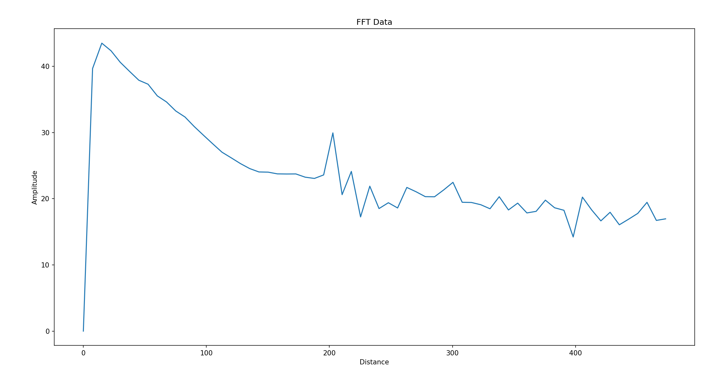

# Arduino-Radar BGT60TR13C Example Program
This example reads the BGT60TR13C radar sensor of the CY8CKIT-062S2-AI Kit from
Infineon and prints the distance-profile over UART.

The server-program (runs on PC) uses this and plots the results.

## Usage
1) Upload the ```plot_range.ino``` to the microcontroller
2) Be sure not to be connected via the serial monitor of the
Arduino IDE. The connection is needed for the server-program.
3) Start Server-Side program using the terminal command   
```python server_cont_receive.py```
 > [!WARNING]
 > The Serial Port inside of the program needs to be changed to
 > the port you're using.

 

 Terminal output consisting of:
 1) Time needed for function
 2) Transmitted data: Format of single packet = \<distance in cm>,\<value>;
   > \>Function readFIFO Time [ms] = 26.00
    0.0,0.00;7.5,39.44;15.0,42.99;22.5,42.12;30.0,40.42;37.6,39.13;45.1,37.41; ...